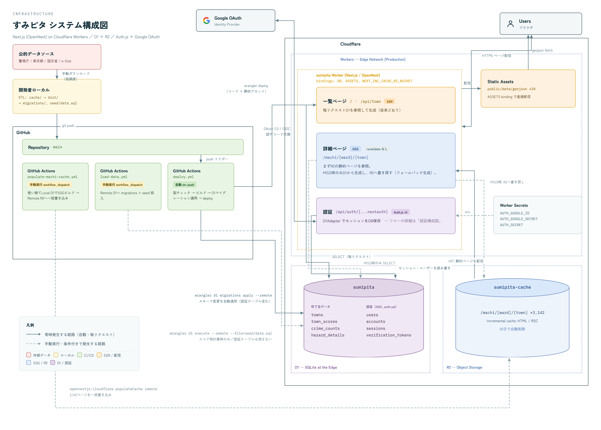

# すみピタ

東京23区の町丁目ごとに治安・洪水・地盤（液状化）・高潮を可視化する引越し先リサーチダッシュボード。

## 構成



### レンダリング

- **一覧ページ** (`/`, `/api/town`): Workers上でSSR。従来通り毎リクエストRemote D1を参照して生成する。
- **区一覧ページ** (`/machi/[ward]`、23ページ) / **詳細ページ** (`/machi/[ward]/[town]`、3,142ページ): SSG。R2 incremental cache (`sumipita-cache`) の静的HTML/RSCを配信する。`deploy.yml`のビルド時に全件事前生成し、そのままR2へ書き込む（詳細は下記deploy.ymlの説明）。万一キャッシュに無いページがあっても、`dynamicParams=true`によりアクセス時にD1から生成してR2へ書き込むフォールバックが効く。既定の鮮度（300秒）を過ぎるとISRのstale-while-revalidateで裏側で再生成される。

### Workers / D1 / R2 / CIの役割

- **Workers**: Next.js (OpenNext) 本体。一覧ページのSSRと、詳細ページのR2キャッシュ読み書きを担当。
- **D1**: `sumipita` DB。一覧ページは毎回、詳細ページはキャッシュMISS時のみ問い合わせる。
- **R2**: バケット。区一覧・詳細ページの静的ページを保持（30日で自動削除のライフサイクルルール設定済み）。
- **CI (GitHub Actions)**: `deploy.yml`（mainへのpushで自動デプロイ。区一覧・詳細ページの全件事前生成とR2キャッシュ書き込みも同じジョブ内で行う）/ `load-data.yml`（手動実行、詳細は下記「データを更新する」）。

> `deploy.yml`は「区一覧・詳細ページを全件事前生成するビルド」と「そのビルドを`wrangler deploy`で実際に配信する」を**同じジョブの同じビルド成果物**に対して行う。以前はこの2つが別ワークフロー（事前生成用の使い捨てビルドと、実際にデプロイするビルド）に分かれていたため、事前生成したHTMLが参照するJSチャンクと実際にデプロイされたチャンクが一致せず、本番でクライアント側エラー（ChunkLoadError）が起きたことがある。buildId（`next.config.mjs`の`generateBuildId`）はNext.jsのデフォルト通り毎ビルドでランダムにしてあり、デプロイのたびに前のbuildId配下のキャッシュは参照されなくなる（R2のライフサイクルルールで自動的に消える）。
>
> 全件事前生成のぶん、デプロイ1回あたり数分かかる（開発が活発な時期はデプロイ頻度が高くその分コストがかさむが、落ち着いてきたら`PRERENDER_ALL_MACHI`をやめてオンデマンド生成のみに戻すことも検討）。

## 実行

```bash
python3 etl/combine_scores.py                # スコア算出 → cache/
python3 etl/export_d1.py [--rebuild]         # D1用CSV + GeoJSON → dist/
python3 etl/make_schema.py                    # migrations/, seed/data.sql を生成
python3 etl/build_web_data.py                 # ポリゴン配置 → web/public/data/geojson/

cd web
npm install
npx wrangler d1 execute sumipita --local --file=migrations/0001_init.sql
npx wrangler d1 execute sumipita --local --file=seed/data.sql
npm run dev
```

`migrations/0001_init.sql` は `make_schema.py` がCSVから毎回まるごと作り直す1本のファイル（同じファイル名）。
`d1 migrations apply` はファイル名ベースで1回きり実行なので、列を追加しても「適用済み」として
スキップされ反映されない。スキーマを更新するときは常に `d1 execute --file=migrations/0001_init.sql`
で直接流すこと（DROP TABLEを含むが、直後に全件を入れ直すので実害はない）。

## データを更新する

スコア・生データを変えたときだけ。3ステップとも必要（片方だけだとページ間でスコアが食い違う）。

```bash
python3 etl/export_d1.py --rebuild
python3 etl/make_schema.py
git add web/migrations web/seed/data.sql
git commit -m "データ更新"
git push
```

1. push → `deploy.yml`が自動デプロイ（区一覧・詳細ページも新しいデータで全件作り直してR2へ反映）
2. GitHub Actions → **Load D1 Data** を手動実行 → Remote D1へmigrations+seedを投入（一覧ページ用）

ローカルで本番相当を見る: `cd web && npm run preview`
